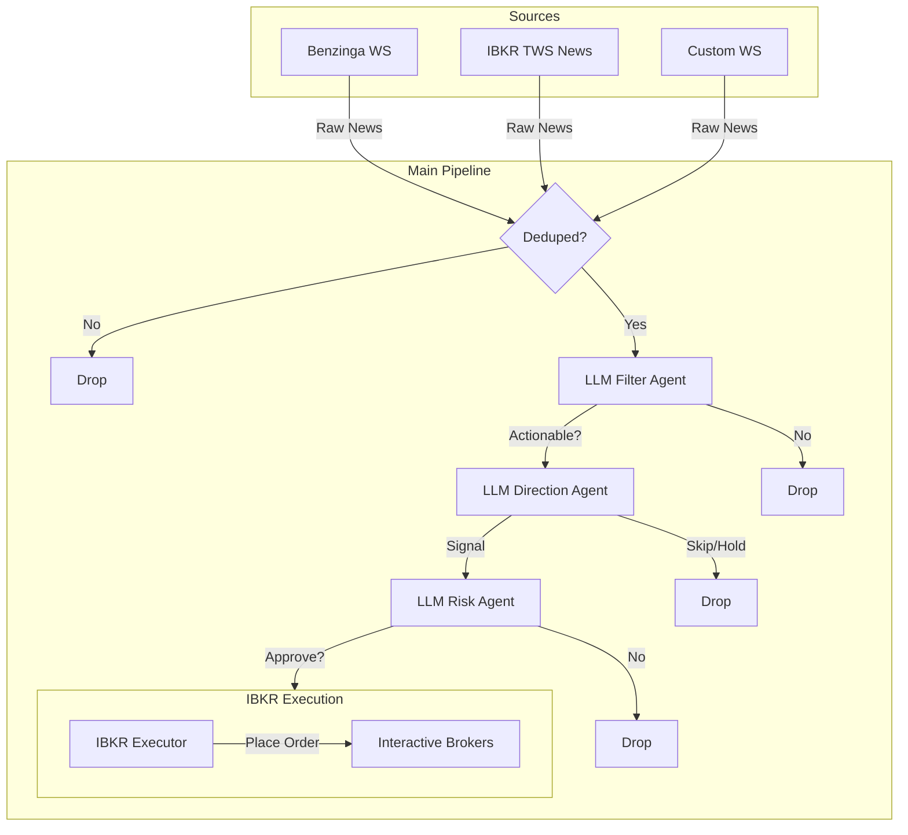

# Trade-The-News

A high-performance, asynchronous algorithmic trading system that ingests real-time news, performs multi-stage deductions using LLMs (Large Language Models), and executes trades via Interactive Brokers (IBKR).

##  Features

*   **Multi-Source Ingestion**: Supports real-time news from Benzinga WebSocket, IBKR (TWS) News, and custom news sources.
*   **Smart Deduplication**: Uses semantic similarity (Embeddings) and exact hashing to filter out duplicate news stories in real-time.
*   **LLM-Powered Analysis**: A multi-agent pipeline analyzes news for:
    *   **Filter Agent**: Filters out noise (macro news, non-actionable analyst ratings).
    *   **Direction Agent**: Determines sentiment, trade direction (Buy/Sell), magnitude, and confidence.
    *   **Risk Agent**: validates trade setups, calculates dynamic stop-losses (ATR-based), and trailing percentages.
*   **Risk Management**: Integrated position sizing based on account equity, volatility (ATR), and signal confidence. Supports adjustable trailing stops.
*   **Execution**: Automated order placement via `ib_insync` for Interactive Brokers, with "bracket-like" logic for innovative trade management.

##  Architecture

The system operates as an asynchronous pipeline:

### Pipeline Visualization


###  Trade Lifecycle Example
Here is how a single trade is conducted from news to execution:

1.  **News Arrival**: The system receives a headline: *"Files 8K: FDA Approves New Drug Application for XYZ Corp"* via Benzinga WebSocket.
2.  **Deduplication**: The system checks if this story has been processed recently using both exact hash match and vector embedding similarity.
3.  **Filter Stage** (Agent 1): The LLM analyzes the headline.
    *   *Result*: `{"actionable": true, "type": "fda_approval"}`.
4.  **Direction Stage** (Agent 2): The LLM analyzes sentiment and improved fundamentals.
    *   *Result*: `{"action": "buy", "confidence": 0.9, "magnitude": "high"}`.
5.  **Risk Stage** (Agent 3): The LLM reviews the plan and calculates technical stops.
    *   *Input*: "Buying XYZ on FDA approval with high confidence."
    *   *System Check*: Fetches current ATR (Average True Range) for XYZ.
    *   *Result*: `{"approve": true, "atr_trail_mult": 2.0}`.
6.  **Position Sizing**: The system calculates share count based on:
    *   Account Equity ($100k)
    *   Risk per trade (1% = $1k)
    *   Volatility (ATR) and Stop Distance.
7.  **Execution**: `ibkr_executor.py` sends a "Snap-to-Mid" Market Order to Interactive Brokers with an attached **Trailing Stop** order to protect profits automatically.

##  Prerequisites

*   **Python 3.10+**
*   **Interactive Brokers Account** (Paper Trading recommended for testing)
*   **IB Gateway or TWS** running locally.
*   **API Keys**:
    *   **OpenAI**: For embeddings (deduplication) and optional fallback models.

##  Installation

1.  **Clone the repository:**
    ```bash
    git clone https://github.com/yourusername/trade-the-news.git
    cd trade-the-news
    ```

2.  **Create and activate a virtual environment:**
    ```bash
    python -m venv .venv
    source .venv/bin/activate  # On Windows: .venv\Scripts\activate
    ```

3.  **Install dependencies:**
    ```bash
    pip install -r requirements.txt
    ```

##  Configuration

The project is configured completely via Environment Variables. You can set these in a `.env` file or export them in your shell.

### Core & API Keys
| Variable | Description | Default |
| :--- | :--- | :--- |
| `BENZINGA_API_KEY` | Key for Benzinga News API (if enabled). | |
| `OPENAI_API_KEY` | Key for OpenAI (required for Dedupe embeddings). | |
| `BENZINGA_WS_URL` | WebSocket URL for Benzinga. | `wss://api.benzinga.com/api/v1/news/stream` |

### News Sources
| Variable | Description | Default |
| :--- | :--- | :--- |
| `ACCEPT_NEWS_BENZINGA` | Enable Benzinga news source. | `0` (False) |
| `ACCEPT_NEWS_TWS` | Enable IBKR TWS news source. | `1` (True) |
| `TWS_BROAD_PROVIDERS` | Comma-separated TWS news providers. | `BZ,FLY,BRFG` |
| `ACCEPT_NEWS_SELFWS` | Enable custom local WebSocket source. | `0` (False) |
| `SELF_WS_URL` | URL for custom WebSocket. | `ws://192.168.0.109:8041/` |

### LLM Settings
| Variable | Description | Default |
| :--- | :--- | :--- |
| `LLM_BASE_URL` | Base URL for LLM API compatible with OpenAI SDK. | `https://` |
| `OPENAI_MODEL` | Primary model for logic agents. | `openai/gpt-oss-120b` |
| `LLM_CONCURRENCY` | Max concurrent LLM requests. | `8` |
| `LLM_TIMEOUT_SECONDS` | Timeout for LLM calls | `300` |

### Trading & Risk
| Variable | Description | Default |
| :--- | :--- | :--- |
| `IB_HOST` | IBKR Gateway/TWS Host IP. | `192.168.0.109` |
| `IB_PORT` | IBKR Gateway/TWS Port. | `4002` |
| `IB_CLIENT_ID` | Unique Client ID for IBKR connection. | `123` |
| `IB_DEFAULT_NOTIONAL` | Fallback trade size ($) if equity check fails. | `10000` |
| `MAX_RISK_PCT` | Max risk per trade as % of equity. | `0.01` (1%) |
| `MAX_POSITION_PCT` | Max position size as % of equity. | `0.10` (10%) |
| `ATR_DURATION` | Lookback period for ATR calc. | `30 D` |
| `ATR_BAR_SIZE` | Bar size for ATR calc. | `1 hour` |
| `DEDUPE_ENABLED` | Enable semantic deduplication. | `1` |

##  Usage

1.  **Start your IB Gateway or TWS** and ensure API connections are enabled on port `4002` (or your configured port).
2.  **Run the main application:**
    ```bash
    # export your keys first!
    export OPENAI_API_KEY="your_key"
    
    python main.py
    ```

3.  **(Optional) Run the Metrics API** to view logs/stats:
    ```bash
    uvicorn metrics_api:app --host 0.0.0.0 --port 2010
    ```

##  Disclaimer

**Trading involves significant risk.** This software is for educational and research purposes only. It is not financial advice. The authors are not responsible for any financial losses incurred while using this software. Always test thoroughly in a paper trading environment before deploying real capital.
